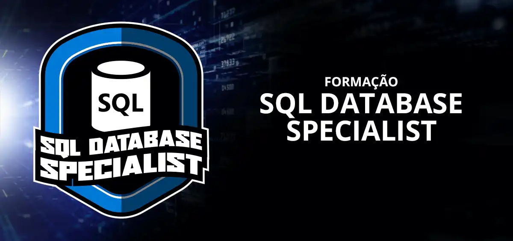

# Bootcamp Database - DIO

> Sobre

Projeto desenvolvido de acordo com as orientações obtidas durante o Bootcamp Database. Neste bootcamp foi possível aprender sobre banco de dados SQL e NOSQL. Além de um vasto conteúdo teórico, foi possível também colocar a mão na massa, criando diversos banco de dados e suas relações de entidades.

## 🛠 Tecnologias 
- MYSQL
- MongoDb
- Cassandra
- Git
- Github

## 💻 Contato 

 > kennylima@hotmail.com